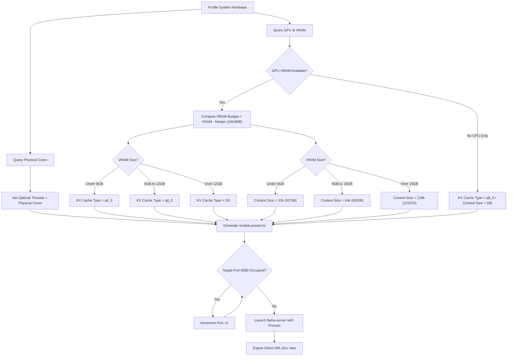

# LLM Manager - System Architecture & Decision Engine Guide

> **Tags & Keywords**: `llama.cpp-architecture` `performance-tuning` `hardware-budgeting` `vram-calculation` `port-collision-algorithm` `local-llm-router`

This document details the internal design, optimization formulas, and automated decision-making logic of **LLM Manager**. The system is built to profile hardware and automatically configure `llama.cpp` parameters to extract maximum performance while guaranteeing system stability.

---

## 1. Decision Flow Overview

The diagram below shows the end-to-end decision path when configuring and launching the local server:

---

## 2. Core Optimization Formulas & Deciders

### A. CPU Thread Allocation (`threads`)
PowerShell queries the system's logical processors and physical cores. For CPU-bound inference execution, running threads on hyper-threaded (logical) cores or efficiency cores (E-cores) causes context-switching overhead and severely degrades performance.
* **Formula**: 
  $$Optimal\ Threads = Physical\ Cores$$
* **Laptop Hybrid Layouts**: In modern chips (e.g. Intel Core Ultra 7), it budgets threads matching the physical Performance cores (P-cores) to prevent scheduling threads on E-cores.

### B. VRAM Memory Budgeting (`fit-target`)
Running out of VRAM causes the operating system to move memory to system RAM (unified memory). In local LLMs, this causes token speeds to drop by up to 90%.
* **Formula**:
  $$VRAM_{budget} = VRAM_{total} - VRAM_{margin}$$
* **Default Margin**: The system reserves a strict $VRAM_{margin} = 1024\text{ MB}$ (1 GB) for Windows Desktop display outputs and background services, allocating the remainder (`fit-target`) to the model layers and KV cache.

### C. KV Cache Quantization (`cache-type-k` / `cache-type-v`)
The VRAM footprint of the model's Key-Value (KV) cache grows linearly with context size. At 128k context, the KV cache can easily exceed 8 GB.
* **GPU-Bound Heuristic**:
  * **Low VRAM (< 6 GB)**: Configures cache type to **`q4_0`** (saves 75% cache VRAM) to prevent crash-on-load.
  * **Medium VRAM (6 - 12 GB)**: Configures cache type to **`q8_0`** (saves 50% cache VRAM, zero quality degradation) to fit larger contexts safely.
  * **High VRAM ($\ge$ 12 GB)**: Kept at **`f16`** (maximum quality).
* **CPU-Bound Heuristic**: 
  * If no GPU is present, memory bandwidth is the primary bottleneck. The system configures the cache to **`q8_0`** to compress memory bandwidth and increase prompt evaluation speeds on CPUs.

### D. Context Size Heuristic (`ctx-size`)
* **VRAM $\le$ 8 GB**: Defaults to **`32768` (32k)**. Restricting the context window on 8GB cards ensures that model layers remain fully offloaded to VRAM.
* **8 GB < VRAM < 16 GB**: Defaults to **`65536` (64k)**.
* **VRAM $\ge$ 16 GB**: Defaults to **`131072` (128k)**.

---

## 3. Dynamic Runtime Decisions

### A. Port Collision Auto-Scanner
At launch, the start script queries active TCP listeners:
1. It retrieves system TCP listener states via `.NET` (`[System.Net.NetworkInformation.IPGlobalProperties]`).
2. If the default port `8080` is open, it binds.
3. If occupied, the scanner loops upward ($Port + 1$) until it finds an unoccupied socket.
4. Once bound, all exported client environment URLs are updated dynamically to route VSCode or Claude Code queries to the correct endpoint without failure.

### B. Chat Template Heuristic Mapping
To prevent formatting errors in API clients, the preset setup scans GGUF file names for keywords and auto-maps native jinja templates:
* `qwen` $\rightarrow$ `chatml`
* `llama3` / `llama4` $\rightarrow$ `llama3`
* `gemma` $\rightarrow$ `gemma`
* `deepseek` $\rightarrow$ `deepseek`
* `mistral` / `mixtral` $\rightarrow$ `mistral-v3`
* Others fallback to the GGUF file's internal metadata.
