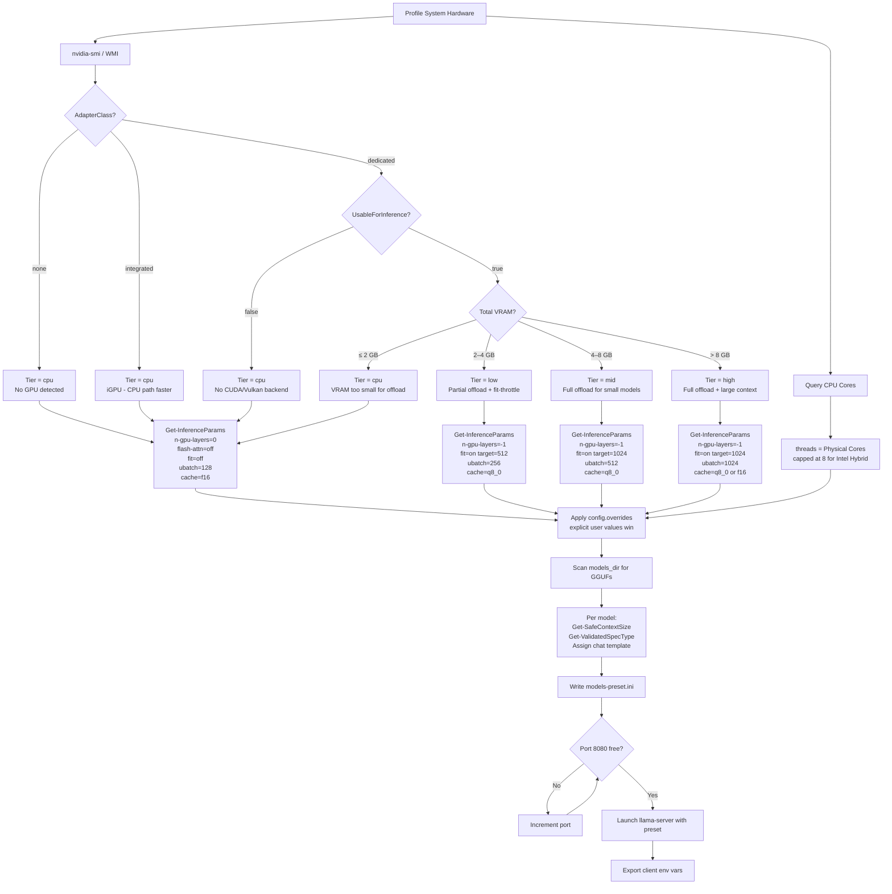

# LLM Manager - System Architecture & Decision Engine

This document details the internal design, hardware classification model, optimization formulas, and automated decision-making logic of **LLM Manager**. Everything described here is implemented in `llo-core/Profile.ps1` and `llo-core/SetupRouter.ps1`.

---

## 1. Two-Step GPU Classification

The system classifies every GPU using two orthogonal dimensions. This avoids conflating hardware identity with inference policy — a 2 GB MX-class discrete GPU is still "dedicated" hardware, but it belongs to the "cpu" performance tier because its VRAM is too small for useful offload.

### AdapterClass (hardware identity)

| Value | Conditions |
|---|---|
| `none` | No GPU detected at all |
| `integrated` | Intel UHD/Iris/HD Graphics, AMD Radeon without "RX" suffix (iGPU), or `AdapterRAM ≈ TotalPhysicalMemory` (shared-memory signature) |
| `dedicated` | Discrete GPU with onboard VRAM confirmed by nvidia-smi or WMI non-shared memory |

> **Note:** Intel Arc is **not** classified as integrated by name alone. Arc A-series cards can be discrete hardware and are classified by VRAM amount and backend availability, not the product name.

Detection priority:
1. **nvidia-smi** (preferred for NVIDIA) — queries all GPUs, selects the one with highest `memory.free` to handle multi-GPU and dual-GPU laptop configurations
   - **Windows**: Probes `C:\Program Files\NVIDIA Corporation\NVSMI\nvidia-smi.exe` and `C:\Windows\System32\nvidia-smi.exe`
   - **macOS / Linux**: Probes `/usr/bin/nvidia-smi`, `/usr/local/bin/nvidia-smi`, and PATH
2. **WMI `Win32_VideoController`** fallback — **Windows only** — filters to non-shared-memory adapters (avoids picking the iGPU on a laptop with both Intel and NVIDIA)
3. **`system_profiler SPDisplaysDataType`** — **macOS only** — detects Apple Silicon (M-series unified memory) and discrete GPUs on Intel Macs
4. **`rocm-smi`** — **Linux only** — detects AMD GPUs via ROCm when installed
5. **`/sys/class/drm` sysfs** — **Linux only** — fallback for any GPU, reads `mem_info_vram_total` from the DRM subsystem

### PerformanceTier (inference policy)

| Tier | Conditions | Reason Printed |
|---|---|---|
| `cpu` | AdapterClass = `none` | "No GPU detected - CPU-only inference" |
| `cpu` | AdapterClass = `integrated` | "Integrated/shared-memory GPU - CPU path delivers better throughput" |
| `cpu` | `UsableForInference = false` | "No compatible backend (CUDA/Vulkan) found - CPU-only inference" |
| `cpu` | Dedicated GPU but VRAM ≤ 2048 MB | "Dedicated GPU VRAM X GB is below 2 GB threshold - CPU-only avoids slow VRAM spill" |
| `low` | Dedicated, 2049–4096 MB VRAM | "Dedicated GPU ~X GB VRAM - partial offload with fit-throttle" |
| `mid` | Dedicated, 4097–8192 MB VRAM | "Dedicated GPU ~X GB VRAM - full offload for small-mid models" |
| `high` | Dedicated, > 8192 MB VRAM | "Dedicated GPU ~X GB VRAM - full offload, large context available" |

Every startup prints the detected tier and its reason so users can verify auto-tuning is correct.

---

## 2. Decision Flow



---

## 3. Core Formulas

### A. CPU Thread Allocation (`threads`)

For LLM inference, hyper-threaded logical cores and E-cores (Intel hybrid) add context-switching overhead. The system targets physical P-cores only.

```
OptimalThreads = PhysicalCores
              capped at 8 for Intel CPUs with > 8 physical cores (P-core sweet spot)
              floored at 4 minimum
```

### B. VRAM Budget (`fit-target`)

VRAM overflow silently spills model layers to system RAM via PCIe, dropping token speed by up to 90%. The `--fit` + `--fit-target` mechanism in llama.cpp automatically throttles `n-gpu-layers` downward until the model fits within the budget.

```
fit-target = 512 MB  (for low GPU tier)
             1024 MB (for mid and high GPU tiers)
```

`--fit` is **only written for GPU tiers** (`low / mid / high`). On `cpu` tier it is omitted entirely — there is no VRAM budget to enforce and the setting produces misleading warnings.

### C. KV Cache Quantization (`cache-type-k` / `cache-type-v`)

KV cache VRAM grows linearly with context size. At 64k tokens the KV cache for a 4B model can consume 2–4 GB depending on quantization.

| Scenario | K type | V type | Rationale |
|---|---|---|---|
| CPU tier | `f16` | `f16` | CPU/integrated has `flash-attn = off`, which strictly prevents KV cache quantization |
| Low GPU (2–4 GB) | `q8_0` | `q8_0` | Safe compromise; q4_0 reserved for emergency only |
| Mid GPU (4–8 GB) | `q8_0` | `q8_0` | Headroom for longer contexts |
| High GPU (> 8 GB) | `q8_0` | `q8_0` | Default; upgrades to `f16` when VRAM > 12 GB |

> **Flash Attention Dependency:** In `llama.cpp`, quantized KV cache formats (e.g. `q8_0`, `q4_0`) strictly require Flash Attention to be enabled (`--flash-attn` or `-fa`). Because CPU and integrated graphics cards do not support or run Flash Attention efficiently, the manager automatically disables it and falls back to full `f16` precision for both K and V caches to prevent loading failures.

> `q4_0` is intentionally **not** a default for any tier. It is available as a manual override (`config.overrides`) for emergency memory-saving scenarios only.

### D. Per-Model Context Size Formula (`ctx-size`)

Context size is computed dynamically as a **ceiling** target: start from the hardware maximum and clamp downward based on the system RAM constraint. (Since `llama-server` supports CPU offloading and mmap, VRAM tightness does not cause loading crashes, only partial layer/cache offloading; thus, RAM is the binding constraint for allocation).

```
modelGB = ModelSize_MB / 1024.0
baseKV  = 12.0 × modelGB   (estimated base KV Cache size in MB per 1k tokens)

kvMBPerKToken = { f16: baseKV × 2.0, q8_0: baseKV, q4_0: baseKV × 0.5 }
                floored at 5.0 MB minimum for safety
                multiplied by parallel_slots

availRAM = BudgetRAM_MB - ModelSize_MB - 512 MB (runtime headroom)

maxCtxFromRam = floor(availRAM / kvMBPerKToken) × 1000 tokens (floored at 4096)

ctxSize = largest of { 4096, 8192, 16384, 32768, 65536, 131072, 262144 } that fits within maxCtxFromRam
```

#### Integration-Aware Context Floor
To prevent client initialization failures, a context floor is enforced if the **Claude Code** integration is active:
* **CPU tier**: Floored at `32768` tokens
* **GPU tiers (low / mid / high)**: Floored at `65536` tokens

User overrides via `config.overrides.ctx_size` take absolute priority and bypass the above formula.

### E. Parallel Slots (`parallel`)

Concurrent slots multiply KV cache pressure. The system defaults to `1` for all tiers and only upgrades to `2` for `mid` and `high` when both conditions hold:

```
parallel = 2  only if:
    RAM_BudgetMB > 16384 MB  AND
    VRAM_BudgetMB > 4096 MB
```

`ngram-simple` gives ~10–15% throughput boost by predicting future tokens from context n-grams. It is enabled for `cpu / mid / high` tiers but validated per-model before writing.

> **Low Performance Tier Exception**: Speculative decoding is disabled on the `low` tier (`spec-type = none`) to minimize additional memory overhead and avoid Out-Of-Memory (OOM) crashes on low VRAM GPUs.

```
incompatible patterns: moe, mixture, vision, llava, clip, phi-3-v, qwen.*vl, minicpm-v, cogvlm
→ if model alias matches any pattern: spec-type = none (with a warning)
→ otherwise: spec-type = ngram-simple
```

---

## 4. Override Policy

`config.overrides` is the single source of explicit user intent. Keys present here take absolute priority over all hardware-derived values.

```json
{
  "overrides": {
    "n_gpu_layers": 0,
    "ctx_size": 32768,
    "ubatch_size": 256,
    "parallel": 1,
    "cache_type_k": "q4_0"
  }
}
```

Auto-derived values fill all keys not present in `overrides`. This design means future default changes (e.g. a new tier threshold) never silently reinterpret old configs.

---

## 5. Dynamic Runtime Decisions

### A. Port Collision Auto-Scanner
At launch, `start-server.ps1` checks active TCP listeners via .NET `IPGlobalProperties`. If port `8080` is occupied by another process, it scans upward (`port + 1`) until a free socket is found. All exported client environment URLs are updated to the resolved port.

### B. Chat Template & Grammar Dynamic Syncing
To avoid outdated static prompt formats and grammar errors, the wizard dynamically retrieves the complete `models/templates` and `grammars` directories from the upstream `ggml-org/llama.cpp` GitHub repository.
- **SHA-Based Smart Caching**: Files are synced via `FetchAssets.ps1`. Downstream runs fetch only the directory listing (lightweight REST API call) and check file SHA hashes against `.assets-manifest.json` to download only new/updated files, preventing redundant network requests.
- **Offline Fallback**: If offline during setup and no templates are downloaded, the system prompts the user to optionally apply a bundled `default.jinja` template to all models.
- **Priority-Based Mapping**: `SetupRouter.ps1` matches local GGUF models to templates in `templates/` using a multi-step priority algorithm:
  1. Exact normalized name match (e.g., `qwen3.5-4b` -> `Qwen3.5-4B.jinja`).
  2. Token substring match (scoring overlaps of model/version tokens).
  3. Default template (`default.jinja`) if enabled via `use_default_template = true`.
  4. Fallback to GGUF's internal metadata template if no matches exist.
- **Grammar Constraints**: Dynamic `.gbnf` files (like `json.gbnf`, `json_arr.gbnf`) are placed in the `grammars/` directory, preventing structural output errors on client requests.

### C. Fallback & Bootstrap Routing
When `$models.Count -eq 0` after scanning:
- If `fallback_provider != "none"`: routes client env vars directly to the configured cloud provider (Anthropic, OpenAI, NVIDIA NIM, or Ollama). No llama-server is started.
- If no fallback is configured: bootstraps a lightweight model from Hugging Face (`Qwen/Qwen2.5-Coder-1.5B-Instruct-GGUF`) via llama-server's `-hf` flag.

### D. Upstream Compatibility Guard
`llo-core/ParseHelp.ps1` and `llo-core/GitDiff.ps1` parse the current llama-server binary's `--help` output and compare it against the previous known-good argument set after a `git pull`. Deprecated or renamed flags are flagged before they cause a silent startup failure. 
- **Two-Pass Parsing Heuristic**: `ParseHelp.ps1` matches any help line starting with a flag token, then runs a regex matcher to extract all long aliases (e.g. `--n-gpu-layers` and its shorthand `-ngl`) from the same line. Each matched alias is individually registered in the allowlist.
- **Verification Exclusion**: `verify-scripts.ps1` excludes external command flags (like `git`, `nvidia-smi`) and PowerShell general flags (e.g., `-ExecutionPolicy`, `--help`, `--version`) to avoid false-positive mismatches.

### E. Client Integrations & Environment Provisioning
To minimize integration friction, the manager provisions settings and environmental variables dynamically:
- **VSCode Workspace generation**: `main.ps1` dynamically creates a `.vscode` folder containing:
  - `tasks.json`: Registers automation tasks for starting/stopping the local server and running script compatibility audits. Uses `powershell.exe` on Windows and `pwsh` on macOS/Linux.
  - `settings.json`: Injects the necessary env keys into `terminal.integrated.env.windows`, `terminal.integrated.env.osx`, and `terminal.integrated.env.linux` so every terminal launched inside the workspace on any OS is pre-routed to the local server.
- **Claude Code CLI Proxying**: Sets `ANTHROPIC_BASE_URL` to the active server endpoint, configures `ANTHROPIC_AUTH_TOKEN = local`, and exports `CLAUDE_CODE_DISABLE_NONESSENTIAL_TRAFFIC = 1` to disable remote telemetry. An interactive picker is offered at launch to start Claude Code directly on the selected local model.
- **Claude Code Operational Limits**: If the `claude-code` integration is active:
  - Enforces `parallel = 2` (minimum floor) to prevent client deadlocks when invoking subagents.
  - Enforces `idle_timeout_sec` of at least `600` seconds (10 minutes) to prevent the server from going to sleep mid-task.
- **Active Port Propagation**: When the port auto-scanner increments the target port, the new port is propagated to all environment definitions dynamically, ensuring clients connect seamlessly regardless of port collision events.

---

## 6. File Map

| File | Role |
|---|---|
| `main.ps1` | Interactive setup wizard — collects paths, writes `llo-config.json`, runs SetupRouter |
| `run-setup.sh` | Bash convenience entry point for macOS/Linux (wraps `pwsh -File main.ps1`) |
| `llo-core/Profile.ps1` | Hardware profiler — CPU/RAM/GPU detection for Windows (WMI), macOS (sysctl/system_profiler), Linux (/proc, nvidia-smi, rocm-smi, sysfs) |
| `llo-core/SetupRouter.ps1` | Parameter derivation + `models-preset.ini` generator |
| `llo-core/ParseHelp.ps1` | llama-server `--help` parser for upstream compatibility checks |
| `llo-core/GitDiff.ps1` | Detects argument changes after `git pull` |
| `script/start-server.ps1` | Terminates old instances, invokes SetupRouter, launches llama-server, exports env vars |
| `script/start-server.sh` | Bash wrapper for macOS/Linux (invokes `start-server.ps1` via `pwsh`) |
| `script/stop-server.ps1` | Gracefully stops the running llama-server process (Windows: Win32_Process; macOS/Linux: lsof/ss) |
| `script/stop-server.sh` | Bash wrapper for macOS/Linux (invokes `stop-server.ps1` via `pwsh`) |
| `script/test-health.ps1` | End-to-end and health checks: schema validation, syntax check, live server ping |
| `script/test-health.sh` | Bash wrapper for macOS/Linux (invokes `test-health.ps1` via `pwsh`) |
| `script/verify-scripts.ps1` | Flag compatibility checker: parses llama-server help output and verifies script args |
| `script/verify-scripts.sh` | Bash wrapper for macOS/Linux (invokes `verify-scripts.ps1` via `pwsh`) |
| `llo-core/FetchAssets.ps1` | Handles downloading and smart SHA-caching of upstream templates/grammars |
| `templates/` | Jinja chat templates; dynamically synced from llama.cpp |
| `grammars/` | GBNF grammar files; dynamically synced from llama.cpp |
| `llo-config.json` | Persistent configuration: model paths, cloud fallback, `overrides` block |
| `models-preset.ini` | Generated at startup; consumed directly by llama-server `--models-preset` |
| `.assets-manifest.json` | Tracks downloaded files' SHA hashes to prevent redundant network requests |

---

**Tags**: `#llama.cpp-architecture` `#hardware-adaptive-inference` `#gpu-tier-classification` `#kv-cache-formula` `#context-size-budget` `#vram-fit-throttle` `#cpu-thread-scheduling` `#local-llm-router`
